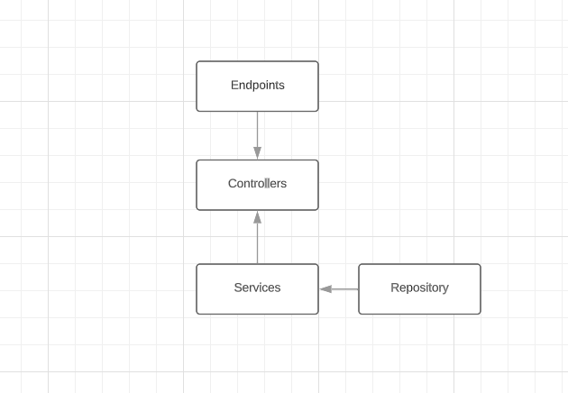

## Architecture


## Description
Esse projeto tem 4 endpoint que pode ser observado na documentação Swagger.
```bash
http://localhost:3000/api/docs
```

Endpoints
- GET /balance - Busca todos os dados salvos no banco de dados fake
- GET /balance/daily - Busca todos os lançamentos agrupando por dia e calculado os débitos e créditos
- POST /manage-release/set-credit - Lança o valor do crédito no banco de dados
- POST /manage-release/set-debit - Lança o valor do débito no banco de dados

Também foi criando testes unitários para os dois serviços(npm run test or npm run test:cov) e testes E2E para todos os endpoints(npm run test:e2e).

Para visualizar o coverage ao rodar npm run test:cov, é só abrir o index.html com o seu browser.
```bash
cd coverage/lcov-report/index.html
```

## Installation

```bash
$ npm install
```

## After Installation (Optional)

```bash
Create .env by copying .env.example
```

## Running the app

```bash
# development
$ npm run start

# watch mode
$ npm run start:dev

# production mode
$ npm run start:prod
```

## Test

```bash
# unit tests
$ npm run test

# e2e tests
$ npm run test:e2e

# test coverage
$ npm run test:cov
```
# Run in Docker
Build Image

```bash
docker build -t carrefour-test .
```

Run Image

```bash
docker run -p 3000:3000 -d carrefour-test
```
